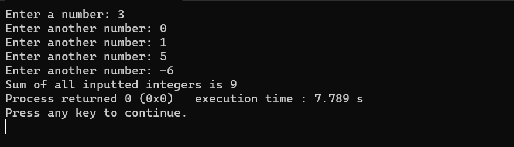

# Number Summation Program



## Introduction

Welcome to the Number Summation Program! This C++ application helps you calculate the sum of a sequence of positive integers. Keep adding numbers until a negative number is entered to find the sum effortlessly.

## Features

- **Efficient Summation**: Quickly calculates the sum of positive integers, providing results with precision.

- **Interactive Interface**: The program's interactive interface guides you through entering numbers and keeps summing until a negative number is input.

- **Educational Tool**: Ideal for educational purposes, quick calculations, and understanding mathematical concepts.

## Demo

Get a quick look at the program in action:


## Installation

To run the program, follow these steps:

1. Clone this repository:
   ```shell
   git clone https://github.com/iMamoonAkhter/Number_Summation_Program.git
